# Description
Android student attendance tracker app with QR code implementation, built with Java in Android Studio. Cloud Firestore was used for backend. 

Lecturers generate a unique QR code, students scan them using the app. Lecturers can see student attendance records for their modules and students can see their own personal attendance. Admins can see all students and lecturers and the attendance of all students.

In Cloud Firestore, a field determines the user type (student, lecturer, admin) based on the email. When a QR code is generated, a random string of 26 characters appears in Cloud Firestore. When a student chooses the respective module and scans the code, it checks if the code they scan is equal to the string. If it is, their attendance is recorded for that day.

I had to learn how to integrate Cloud Firestore with Java fairly quickly. It reassured me that I'm disciplined enough to grasp unfamiliar concepts given enough time.

# Demo Video

https://youtu.be/GFYiaelAy5A

# How to Use
For the lecturer's perspective, the login credentials are teacher1@mail.com and password. For the student's, it is student1@mail.com and password. For the admin's, it is admin1@mail.com and password.

# Test Results
Our black-box unit testing test results can be found <a href="TestPlanResults.docx">here.</a>

# Screenshots

<h3> Login Screen </h3>
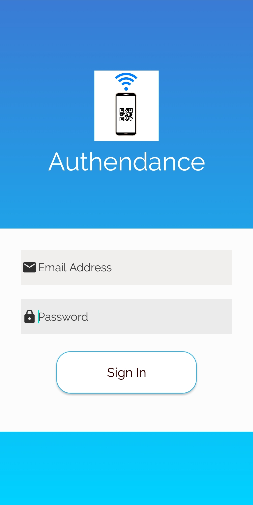

<h3> Teacher Dashboard Screen </h3>
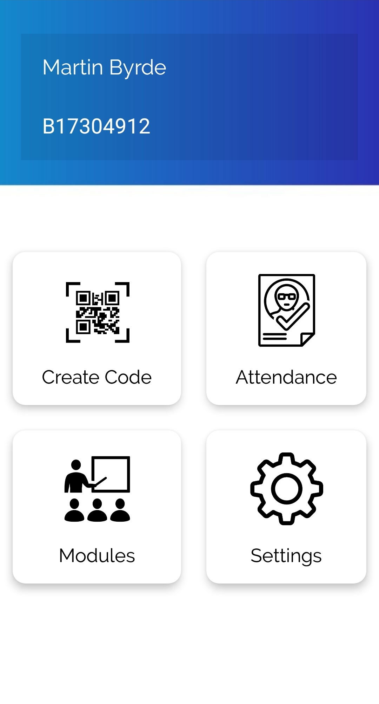

<h3> Module Select Screen</h3>
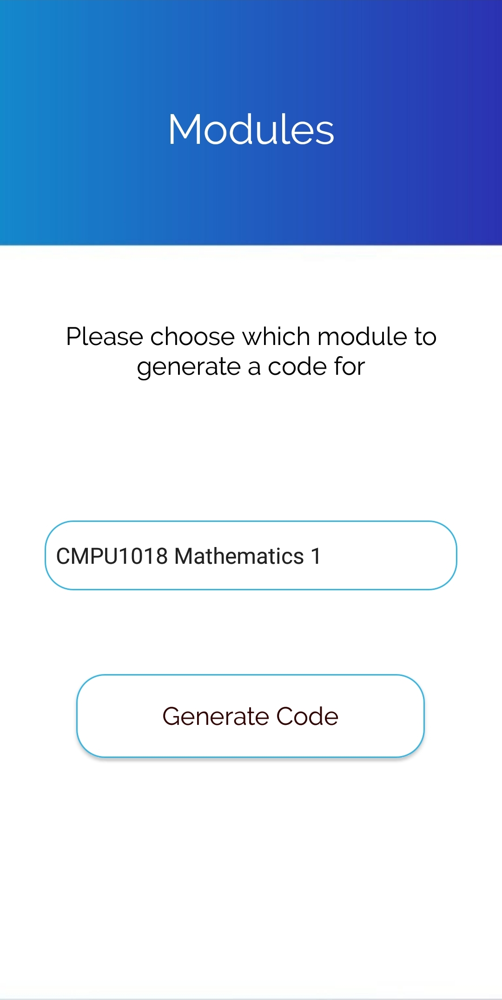

<h3> Code Screen </h3>
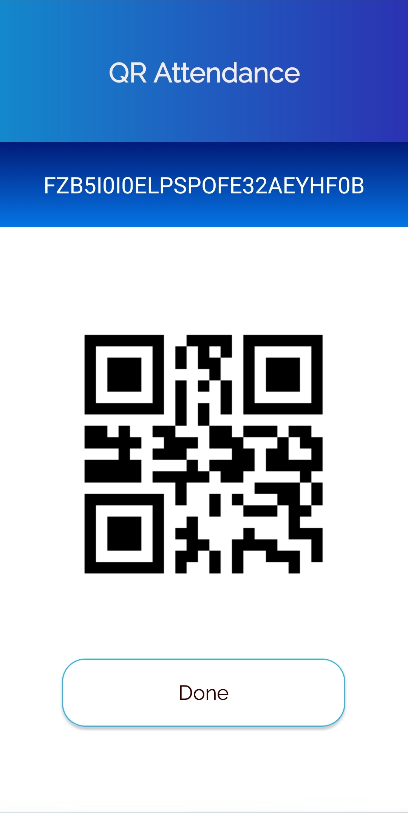

<h3> Attendance Select Screen </h3>
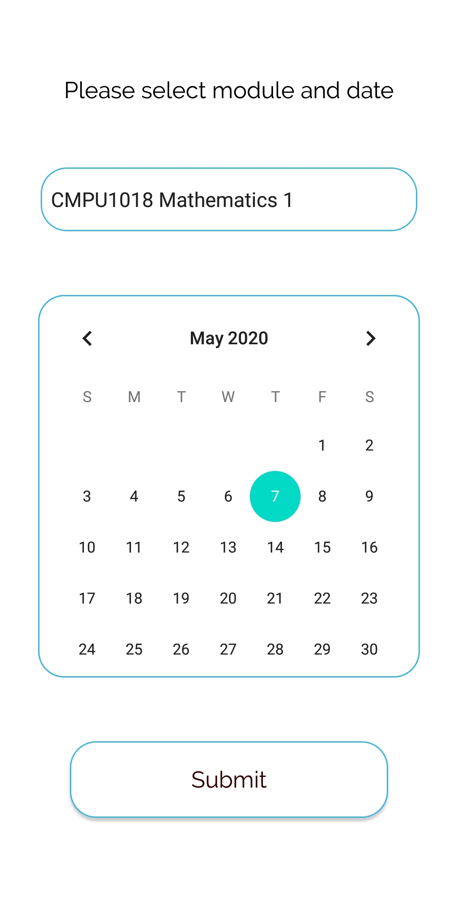

<h3> Student Attendance Screen </h3>
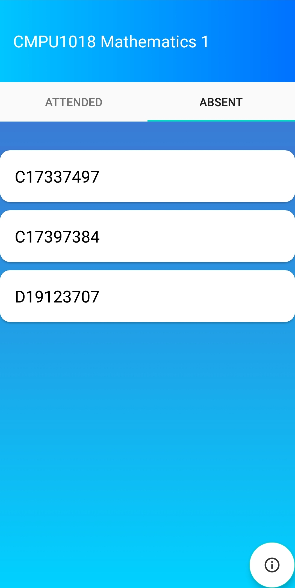

<h3> Student Screen </h3>
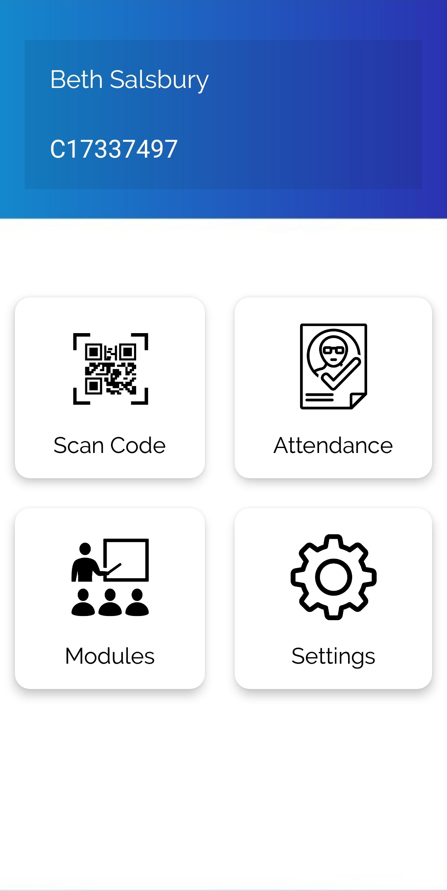

<h3> Attendance Overview Screen </h3>
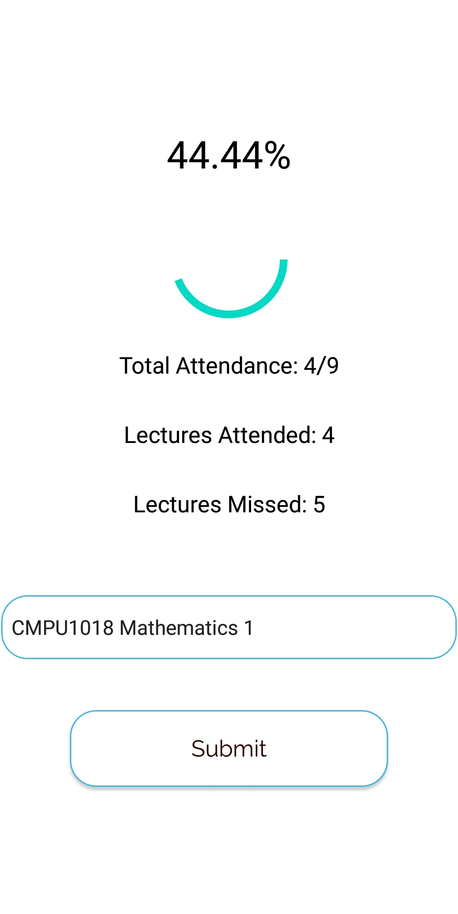

<h3> Personal Attendance Screen </h3>

<h3> Modules Screen </h3>

<h3> Admin Screen </h3>
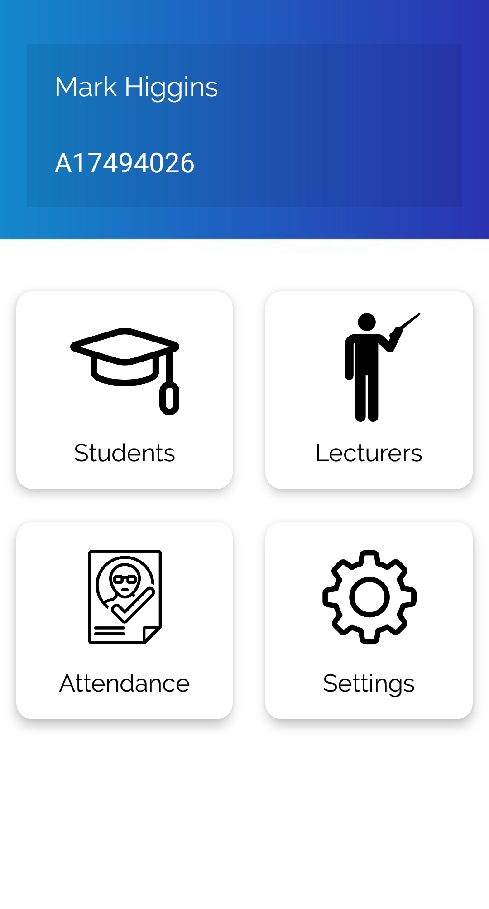

<h3> Student List </h3>
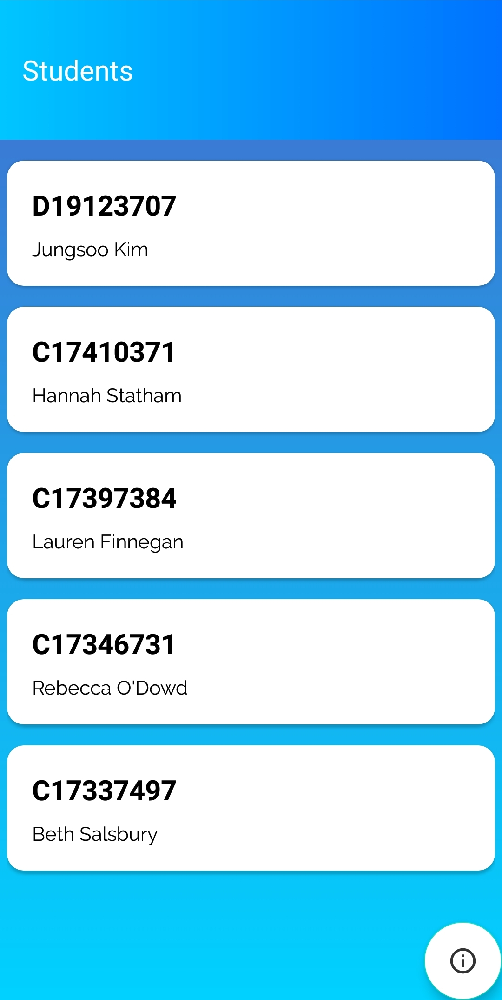

<h3> Teacher List </h3>
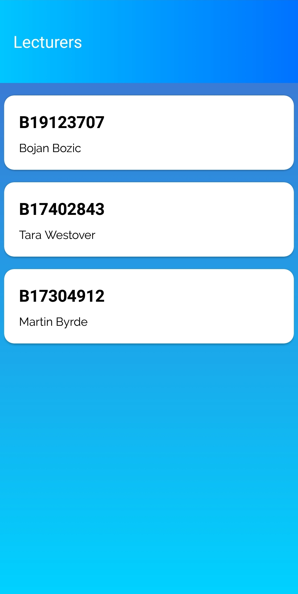

<h3> Overall Attendance Screen </h3>
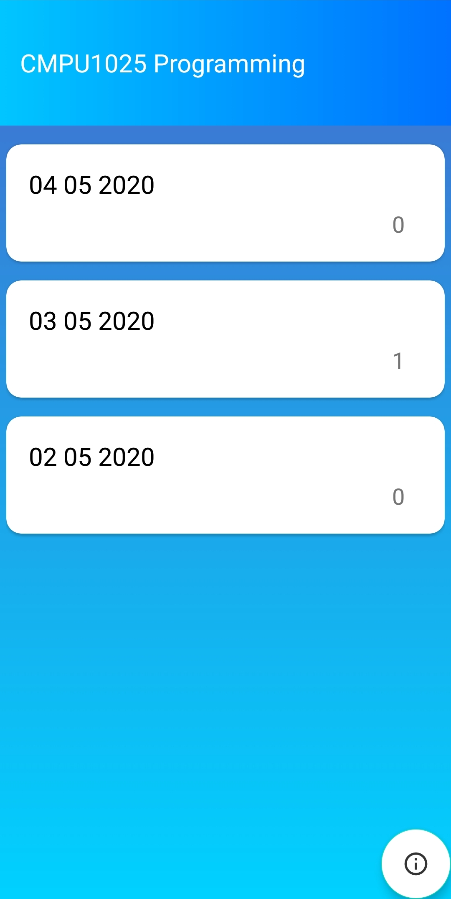

<h3> Settings Screen </h3>
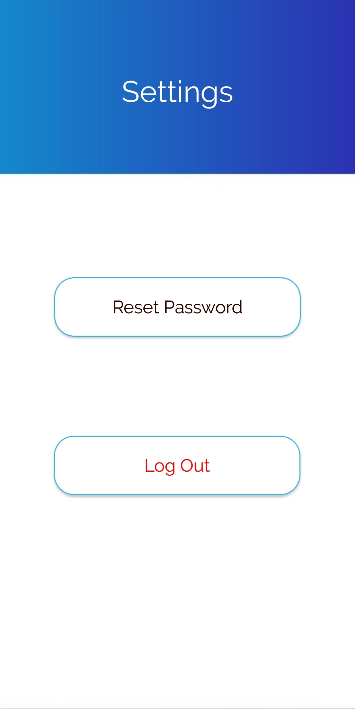
