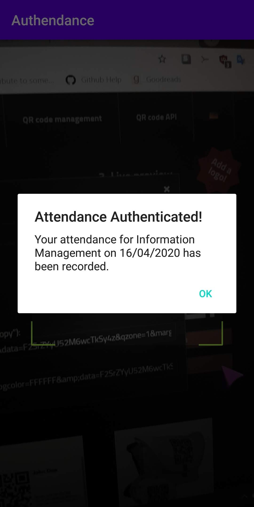

# Authendance Summary
For the Global Classroom module in TU Dublin. 2019/2020 academic year. DT282/3.

Authendance is a student attendance tracker app with QR code implementation, built using Java in Android Studio. Database implementation is accompished via Firebase. The app allows lecturers to generate QR codes, which students scan with their own Android phones to record their attendance for that specific module on that date. Each QR code generated has a 10 minute timer. After the timer has ended, the QR code is invalid and the attendance will not be recorded. Lecturers can only generate QR codes for their own modules and students can only scan codes for modules they are enrolled in.

# Under The Hood
- Programming Language: Java
- IDE/Compiler: Android Studio 3.6
- Minimum SDK version: API level 19 **NB: This may change due to libraries, widgets etc requiring higher API levels.**

# Screenshots
Login Screen 

Scan Screen

Generate Screen

